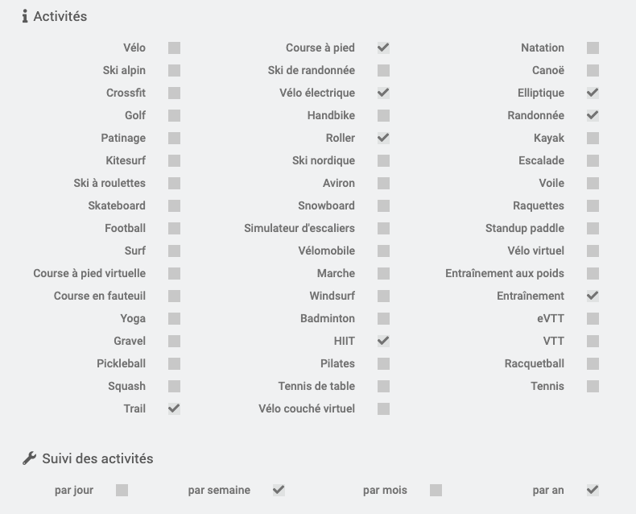

# Mentions Légales

>Le nom et les logos Strava sont tous protégés par les lois applicables en matière de marques, de droits d'auteurs et de propriété intellectuelle.
Ce plugin n'est pas une application officielle Strava. Il est compatible avec Strava au travers le l'API Strava (voir [https://developers.strava.com/](https://developers.strava.com/) )

Le plugin Strava de Jeedom a été développé de manière à être compatible avec Strava.

***

# Description

Ce plugin permet d'associer Jeedom à Strava, et ainsi récupérer les activités de l'athlète.
L'objectif n'est pas de dupliquer les informations contenues dans Strava, mais plutôt de récupérer les informations pertinentes des activités, et de les consolider pour avoir une vue personnalisée.

>Par exemple, Strava propose par défaut un résumé hebdomadaire et annuelle pour trois sports : natation, vélo, et course à pied. Avec le plugin, il est possible d'avoir ce même résumé pour 50 sports différents !
>

Le plugin se base sur l'API Strava, qui péopose 2 types de requêtes.

- Les requêtes dites 'pull', où le plugin va chercher les informations dans Strava.
- les requêtes dites 'push' quand Strava envoie une notification au plugin pour l'informer d'un changement dans Strava. C'est le cas par exemple quand une nouvelle activité est synchronisée entre votre montre et Strava, après une belle séance de vélo !

Grâce à ce plugin, vous serez en temps réel au courant de votre bilan sportif, avec pour chacune des activités sélectionnées:

- le nombre d’occurrences dans le jour, la semaine, le mois et l'année,
- le cumul des kilomètres du jour, de la semaine, du mois et dans l'année,
- le cumul de dénivelé positif du jour, de la semaine, du mois et de l'année,
- le cumul de temps du jour, de la semaine, du mois et de l'année.

Pour les activités suivies, vous pouvez choisir votre granularité (jour, semaine, mois, année). Vous aurez egalement un resumé quotidien, hebdomadaire, mensuel et annuelle de l'ensemble de vos
activités, quelles soient selectionnées ou non.

Strava propose également un service d'analyse de vos performances, qui prend bien sûr en compte votre poids. Au travers du plugin, il est également possible de mettre votre poids à jour dans Strava, en utilisant par exemple les informations de votre balance connectée (merci à mmourcia pour l'idée !).
