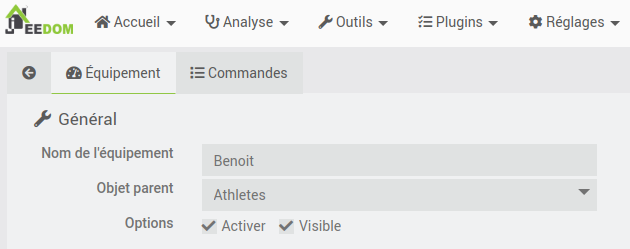
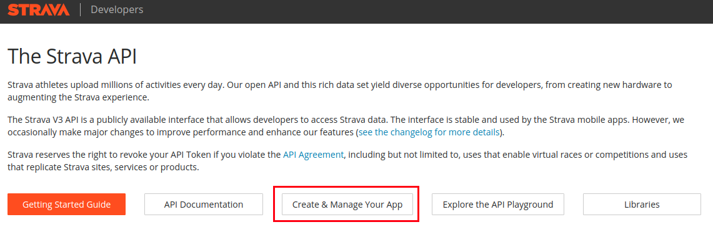
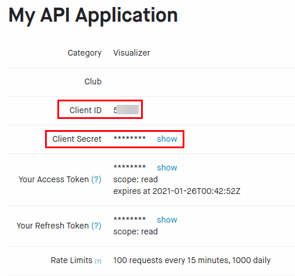
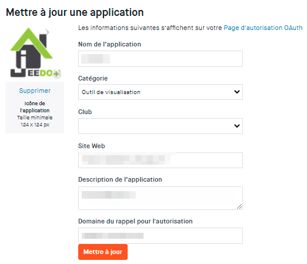
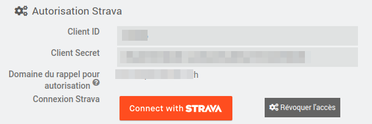
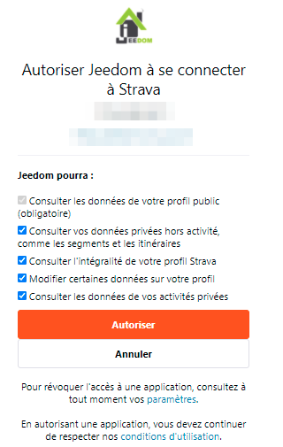
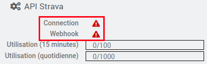
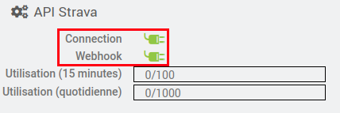
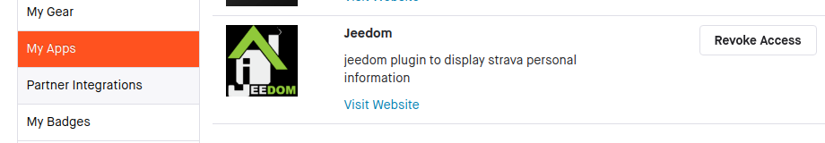

# Mentions Légales

>Le nom et les logos Strava sont tous protégés par les lois applicables en matière de marques, de droits d'auteurs et de propriété intellectuelle.
Ce plugin n'est pas une application officielle Strava. Il est compatible avec Strava au travers le l'API Strava (voir [https://developers.strava.com/](https://developers.strava.com/) )

Le plugin Strava de Jeedom a été développé de manière à être compatible avec Strava.

***

# Description

Ce plugin permet d'associer Jeedom à Strava, et ainsi récupérer les activités de l'athlète.
L'objectif n'est pas de dupliquer les informations contenues dans Strava, mais plutôt de récupérer les informations pertinentes des activités, et de les consolider pour avoir une vue personnalisée.

>Par exemple, Strava propose par défaut un résumé hebdomadaire et annuelle pour trois sports : natation, vélo, et course à pied. Avec le plugin, il est possible d'avoir ce même résumé pour 37 sports différents !

>

Le plugin se base sur l'API Strava, qui propose 2 types de requêtes.
- Les requêtes dites 'pull', où le plugin va chercher les informations dans Strava.
- les requêtes dites 'push' quand Strava envoie une notification au plugin pour l'informer d'un changement dans Strava. C'est la cas par exemple quand une nouvelle activité est synchronisée entre votre montre et Strava, après une belle séance de vélo !

Grâce à ce plugin, vous serez en temps réel au courant de votre bilan sportif, avec pour chacune des activités sélectionnées:
- le nombre d’occurrences dans la semaine et dans l'année
- le cumul des kilomètres dans la semaine et dans l'année
- le cumul de dénivelé positif dans la semaine et dans l'année
- le cumul de temps dans la semaine et dans l'année,

et plus globalement:
- nombre d'activités par jour.
- la durée des efforts par jour.
- le cumul du nombre d'activités pour la semaine en cours.
- le cumul de la durée des efforts de la semaine en cours.
- le cumul du nombre d'activités pour l’année en cours.
- le cumul de la durée des efforts de l’année en cours.

Strava propose également un service d'analyse de vos performances, qui prend bien sûr en compte votre poids. Au travers du plugin, il est également possible de mettre votre poids à jour dans Strava, en utilisant par exemple les informations de votre balance connectée (merci à mmourcia pour l'idée !).

# Installation

Afin d'utiliser le plugin, vous devez le télécharger, l'installer et l'activer comme tout plugin Jeedom.
Il n'y à pas de configuration particulière à faire sur le plugin.

# Configuration de l'équipement, ou plutôt de l'ATHLETE !

Le plugin se trouve dans le menu Plugins > Santé.
Après avoir créé un nouvel athlète, vous devez impérativement remplir les différentes sections de configuration du plugin.

La configuration est un peu complexe, en raison de la mise en place d'autorisations négociées entre le plugin et Strava. Maintenant, vous avez l'habitude, il s'agit d'une autorisation oauth2 que l'on retrouve dans de nombreux plugins !

Il y a trois sections distinctes afin de configurer le plugin:
- Générale
- Autorisation Strava
- Sélection des Sports

## Général

La section équipement sert à configurer les paramètres habituels de Jeedom,

## Autorisation Strava

Cette étape est indispensable, elle permet de lier le plugin Jeedom à Strava, afin de récupérer les informations contenues dans Strava. Plusieurs étapes sont nécessaires pour connecter le plugin à Strava. Ces étapes permettent d'authentifier le plugin à Strava, et à lui fournir les autorisations d'accès nécessaires.

### Configuration de Strava

#### Création d'une application Strava

Rendez-vous sur le site [https://developers.strava.com/](https://developers.strava.com/) afin de créer une application. Cliquez sur le bouton 'Create and Manage your App'

#### Sur la page de Strava, allez dans "Profile -> Settings"

#### Cliquez sur 'Mon application API' sur la gauche de la fenêtre.

#### Récupérez les 2 valeurs : **Client ID **et **Client Secret**, copiez/collez ces valeurs
dans un fichier, nous en aurons besoin pour configurer l'athlète dans le plugin Jeedom.

#### Descendez dans la fenêtre, jusqu'à la partie 'Mettre à jour une application'

Ce sont les informations qui apparaîtront quand Strava vous demandera d'accorder les permissions au plugin Jeedom.
- **Nom de l'application**: Choisissez un nom d'application "original", de façon à ce qu'il soit unique.
Par exemple, utilisez votre nom de domaine: (xxxx.ovh -> xxxx), et surtout évitez Jeedom.
Il est important que le nom soit unique, car le nombre de requêtes quotidiennes à Strava est limité par application à 100 requêtes toutes les 15 minutes, et 1000 requêtes par jour.

- **Categorie**: J'ai mis **Outil de visualisation**

- **Website**: C'est le web site permettant d'accéder à votre Jeedom, donc par exemple jeedom.xxxx.ovh

- **Domaine du rappel pour autorisation**: Recopiez dans cette zone, les informations 'Domaine du rappel pour autorisation' de l'athlète que vous êtes en train de créer (voir ci-dessous).

## Autorisation dans le plugin Strava de Jeedom

* copiez dans **Client ID **et **Client Secret** les informations obtenues sur le site de Strava (voir ci-dessus)
* copiez le '**Domaine du rappel pour autorisation**' depuis Jeedom vers Strava.

>**IMPORTANT**
>
> Il est indispensable que le domaine que vous spécifiez dans la zone 'Domaine du rappel pour autorisation' soit accessible depuis l'extérieur en https. Le nom utilisé par le plugin est le nom configuré dans Jeedom, dans la section réseau.

Si vous avez une erreur vous indiquant que vous devez d'abord être connecté pour exécuter cette action, alors, vous devez vous connecter à Jeedom en utilisant le nom de domaine externe et non pas l'adresse locale.

#### Connect with Strava

Ouf, le moment est venu de connecter Jeedom et Strava grâce aux informations que vous venez de saisir. Cliquez sur le bouton orange **Connect with Strava**.

Le plugin va se connecter à Strava, et vous allez être redirigé vers une page d'autorisation, qui est similaire à celle-la:

Acceptez les autorisations demandées:
- Consultez les données de votre profil public: (obligatoire)
- Consultez vos données privées hors activité, comme les segments et les itinéraires.
- Consultez l’intégralité de votre profil Strava
- Modifiez certaines données sur votre profil: pour mettre à jour le poids depuis Jeedom.
- Consultez les données de vos activités privées.

Une fois l'autorisation 'accordée' à Jeedom d’accéder aux données Strava, vous devez avoir les deux indicateurs 'Connexion' et 'Webhook' passe d'un triangle danger à une prise connectée.

Avant:

Après:

Si vous en êtes la, **c'est gagné**.

>Note:
>Si, lorsque vous avez validé l'autorisation, vous recevez un message 'Invalide state', il est possible que l'application Strava ne soit pas encore disponible. Il faut attendre une quinzaine de minutes entre la création de l'application Strava, et le fait de pouvoir l'utiliser.

## Sélection des sports

Cochez les sports que vous voulez surveiller. Si vous faites d'autres sports qui sont présents dans Strava, vous n'aurez pas le détail (nombre de séances, distance, durée et dénivelé), mais ceux-ci apparaîtront dans les cumuls globaux.

1/ les sports configurés sont les sports pour lesquels vous voulez le detail des activités. Pour chaque sport coché, vous aurez le nombre de séances, le temps d'effort et le dénivelé par semaine et par an.
2/ Il y a également 6 compteurs "globaux", c'est-à-dire indépendant des sports sélectionnés dans la configuration de l'athlète.  

- Compteur du nombre d'activités par jour. Ce champ est historisé par défaut, mode de lissage "max", et gardé pendant 1 an.
- Durée des efforts par jour. Ce champ est historisé par défaut, mode de lissage "max", et gardé pendant 1 an.
- Cumul du nombre d'activités pour la semaine en cours.
- Cumul de la durée des efforts de la semaine en cours.
- Cumul du nombre d'activités pour l’année en cours.
- Cumul de la durée des efforts de l’année en cours.
Ces compteurs permettent de "surveiller" uniquement les activités les plus courantes, mais d'avoir en même temps des compteurs d’activités plus globaux. Par exemple, j'ai fait de manière très occasionnelle des raquettes à neige cet hiver, j'ai envie de voir apparaître ces sorties dans mes compteurs annuels, sans toutefois surveiller l’activité 'Raquettes'.

> Note:
> Il à été volontairement choisi de ne pas créer tous les sports car il y à huit commandes créées par sport (4 pour la semaine, 4 pour l'année), donc cela fait trop de commandes inutiles.

## Sauvegardez l'athlète !!!!

Étape importante et indispensable si vous voulez importer l'historique de vos efforts.

## Importation de l'historique de l'année

Cette étape est optionnelle. Elle permet cependant de récupérer toutes vos activités depuis le début de l'année, et de créer les résumés annuels pour chaque sport sélectionné.

Pour cela, il vous suffit de cliquer sur le bouton 'Raz Statistiques'

## Bravo !

Bravo, vous avez configuré le plugin Strava, il est maintenant lié à Strava, et va recevoir de manière automatique les nouvelles activités enregistrées dans Strava.
Dans la section 'Statistiques', la zone 'Dernière mise à jour' vous indique la dernière fois que des informations ont été reçues par le plugin. S'il n'y à pas de mise à jour dans Strava, il est normal que cette date ne change pas.

Cela veut peut-être dire qu'il est temps de faire un peu de sport, hein !

# Sauvegarde en base de données

Toutes les informations sont sauvegardées dans la base de données de Jeedom, dans 2 tables (stravaActivity et stravaSport). La taille des tables reste très raisonnable, car seulement une partie des informations fournies par Strava est stockée.
L'utilisation de cette base de données permet
- de supprimer les données de Jeedom, quand elles sont supprimées de Strava.
- de sauvegarder les informations de toutes les activités pratiquées, quelque soit le filtre que vous appliquez pour l’athlète. Donc, si vous cochez/décochez des sports à afficher dans l’athlète, il n'y a pas besoin de faire une remise à zéro des statistiques.

# A quoi servent les boutons "Rafraîchir les données", "Forcer la mise a jour", et "RaZ Statistiques"

- **Rafraîchir les données**: utilise la base de données Jeedom pour rafraîchir toutes les informations de l'athlète. Cela est utile notamment quand vous ajoutez ou supprimez des sports à "surveiller".
- **Forcer la mise a jour**: si les informations du widget ne vous semblent pas à jour, alors vous pouvez cliquer sur ce bouton. Jeedom va chercher à "compléter" les données manquantes depuis la dernière mise a jour, et rafraîchir les données en utilisant les dernières informations de la base de données Jeedom.
- **RaZ statistiques**: doit être fait lors de la création d'un athlète, pour récupérer l'historique depuis Strava. Cela peut également
être utilisé pour effacer toutes les informations de la base de données Jeedom pour cet athlète, puis récupérer l'ensemble des données de l'athlète depuis Strava, avant de rafraîchir les informations en utilisant la base de données Jeedom.

# Limitations connues

- Il n'y a pas pour l'instant de gestion des équipements (chaussures, vélos, ...). C'est en projet, mais cela viendra un peu plus tard, après la stabilisation (beta) du plugin.
- le widget est ***"moche"***, j'en suis bien conscient, mais les informations sont là. Libre à vous de créer un virtuel, ou un 'customTemplate' permettant d'avoir une visualisation plus jolie par sport, avec icône, des temps qui ne soient pas en secondes, et ....
Il y a pas mal de personnes très douées dans la communauté pour ce genre de tache, avec de la chance, elles sont aussi sportives et interessées par ce plugin.

# Désinstallation du plugin

Si vous changez d'avis, et que vous souhaitez désinstaller le plugin, ou tout simplement supprimer les autorisations entre Jeedom et Strava, vous avez deux possibilités:
- il vous suffit de cliquer sur le bouton 'Révoquer l'accès'

- ou sur le site de Strava, aller dans Profile->Settings. Sélectionner l'application (ici icône Jeedom), et cliquer sur le bouton 'Revoke Access'

# En cas de difficulté

Si malgré cette documentation et après voir lu les sujets en rapport avec le plugin sur [community]({{site.forum}}) vous ne trouvez pas de réponse à votre question, n'hésitez pas à créer un nouveau sujet en n'oubliant pas de mettre le tag du plugin ({{site.tagPlugin}}).
