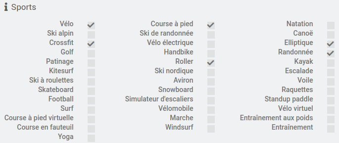
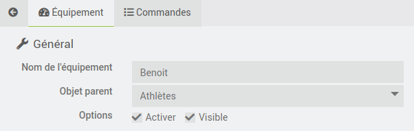
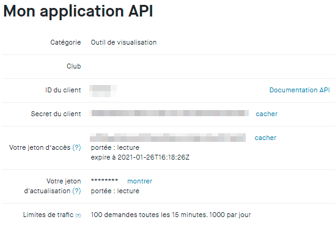

#Mentions Legales
>
>Le nom et les logos Strava sont tous protégés par les lois applicables en matière de marques, de droits d'auteur et de propriété intellectuelle.
Ce plugin n'est pas une application officielle Strava. Il est compatible avec Strava au travers le l'API Strava (see https://developers.strava.com/)

# Description

Ce plugin permet d'associe Jeedom a Strava, et ainsi recuperer les activitees de l'athlete.
L'objectif n'est pas de dupliquer les informations contenues dans Strava, mais plutot de 
recuperer les informations pertinentes des activitees, et de les consolider pour avoir une 
vue personnalisee.

>Par exemple, Strava propose par defaut un resume hebdomadaire et annuelle pour trois sports
>(natation, velo, et course a pied). Avec le plugin, il est possible d'avoir ce meme resume
>pour 37 sports !
>

Le plugin se base sur l'API Strava, qui propose 2 types de requetes.
Les requetes dites 'pull', ou le plugin va chercher les informations dans Strava, et les 
requetes dites 'push' quand Strava envoie une notification au plugin pour l'informer d'un
changement dans Strava. C'est la cas par exemple quand une nouvelle activitees est creee,
apres la synchronisation de votre montre apres une belle seance de velo !

Grace a ce plugin, vous serez en temps reel au courant de votre bilan sportif, avec pour
chaque activitees selectionnees:
* le nombre d'occurence dans la semaine et dans l'annee
* le cumul des kilometres dans la semaine et dans l'annee
* le cumul de denivelle positif dans la semaine et dans l'annee
* le cumul de temps dans la semaine et dans l'annee,

Strava propose egalement un service d'analyse de vos performances, qui prends bien sur
en compte votre poids. Au travers du plugin, il est egalement possible de mettre votre
poids a jour dans Strava, en utilisant par exemple les informations de votre balance 
connecteei (merci a mmourcia pour l'idee !). 

# Installation

Afin d'utiliser le plugin, vous devez le telecharger, l'installer et 
l'activer comme tout plugin Jeedom.
Il n'y a pas de configuration particuliere a faire sur le plugin.

# Configuration de l'équipement, ou plutot de l'ATHLETE !

Le plugin se trouve dans le menu Plugins > Sante.
Après avoir créé un nouvel athlete, vous devez imperativement remplir
les differentes sections de configuration du plugin.

Il y a trois sections distinctes afin de configurer le plugin:
* General
* Autorisation Strava
* Selection des Sports

## General

La section equipement sert a configurer les parametres habituels de jeedom, 

## Autorisation Strava

Cette etape est indispensable, elle permet de lier le plugin Jeedom a Strava, afin de 
recuperer les informations contenues dans Strava. Plusieurs etapes sont necessaire pour
connecter le plugin a Strava. Ces etapes permettent d'authentifier le plugin a Strava, 
et a lui fournir les autorisations d'acces necessaire. 

### Configuration de Strava

1/ Sur la page de Strava, aller dans "Profile -> Settings"

2/ Aller 'My API Application'

3/ Recuperer les 2 valeurs : Client ID et Client Secret, copier/coller ces valeurs 
dans un fichier.

4/ Descendez dans la fenetre, jusqu'a la partie 'Update Application'

Ceux sont les informations qui apparaitront quand Strava vous demandera d'accorder
les permissions au plugin Jeedom.
* Application Name: Choisisser un nom d'application "original", de facon a ce qu'il soit unique.
Par exemple, utilisez votre nom de domaine: (xxxx.ovh -> xxxx)
Il est important que le nom soit unique, car le nombre de requetes quotidiennnes a Strava est limite,
a 100 requetes toutes les 15 minutes, et 1000 requetes par jour.

* Category: J'ai mis Visualizer

* Website: C'est le web site permettant d'acceder a votre jeedom, donc par exemple jeedom.xxxx.ovh

* Authorization Callback Domain: Recopier dans cette zone, les informations 'Authorization Callback Domain' de l'athlete que vous etes entrain de creer. 

## Autorisation dans le plugin Strava de Jeedom

* copier dans Client ID et Client Secret les informations obtenues sur le site de Jeedom
* copier l 'Authorization Domain Callback' depuis Jeedom vers Strava.

>**IMPORTANT**
>
> Il est indispendable que le domaine que vous specifiez dans l'authorization Domain Callback' soit 
> accessible depuis l'exterieur en https. Le nom utiliser par le plugin est le nom configurer dans 
> jeedom, dans la section reseau.

Pour resumer, voici les champs que vous devez configurer dans l'athlete et Strava

## Selection des sports

Si malgré cette documentation et après voir lu les sujets en rapport avec le plugin sur [community]({{site.forum}}) vous ne trouvez pas de réponse à votre question, n'hésitez pas à créer un nouveau sujet en n'oubliant pas de mettre le tag du plugin ({{site.tagPlugin}}).
