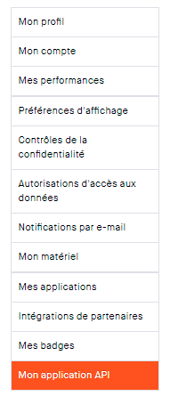
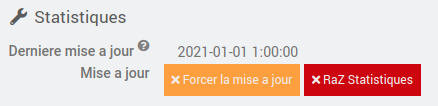

# Mentions Legales

>Le nom et les logos Strava sont tous protégés par les lois applicables en matière de marques, de droits d'auteur et de propriété intellectuelle.
Ce plugin n'est pas une application officielle Strava. Il est compatible avec Strava au travers le l'API Strava (see [https://developers.strava.com/](https://developers.strava.com/) )

Le plugin Strava de jeedom a ete developpe de maniere a etre compatible avec Strava.

***

# Description

Ce plugin permet d'associer Jeedom a Strava, et ainsi recuperer les activitees de l'athlete.
L'objectif n'est pas de dupliquer les informations contenues dans Strava, mais plutot de recuperer les informations pertinentes des activitees, et de les consolider pour avoir une vue personnalisee.

>Par exemple, Strava propose par defaut un resume hebdomadaire et annuelle pour trois sports : natation, velo, et course a pied. Avec le plugin, il est possible d'avoir ce meme resume pour 37 sports differents !

>

Le plugin se base sur l'API Strava, qui propose 2 types de requetes.
- Les requetes dites 'pull', ou le plugin va chercher les informations dans Strava. 
- les requetes dites 'push' quand Strava envoie une notification au plugin pour l'informer d'un changement dans Strava. C'est la cas par exemple quand une nouvelle activitees est synchronisee entre votre montre et Strava, apres une belle seance de velo !

Grace a ce plugin, vous serez en temps reel au courant de votre bilan sportif, avec pour chaune des activitees selectionnees:
- le nombre d'occurence dans la semaine et dans l'annee
- le cumul des kilometres dans la semaine et dans l'annee
- le cumul de denivelle positif dans la semaine et dans l'annee
- le cumul de temps dans la semaine et dans l'annee,

Strava propose egalement un service d'analyse de vos performances, qui prends bien sur en compte votre poids. Au travers du plugin, il est egalement possible de mettre votre poids a jour dans Strava, en utilisant par exemple les informations de votre balance connectee (merci a mmourcia pour l'idee !). 

# Installation

Afin d'utiliser le plugin, vous devez le telecharger, l'installer et l'activer comme tout plugin Jeedom. 
Il n'y a pas de configuration particuliere a faire sur le plugin.

# Configuration de l'équipement, ou plutot de l'ATHLETE !

Le plugin se trouve dans le menu Plugins > Sante.
Après avoir créé un nouvel athlete, vous devez imperativement remplir les differentes sections de configuration du plugin. 

La configuration est un peu complexe, en raison de la mise en place d'autorisations negociees entre le plugin et Strava. Maintenant, vous avez l'habitude, il s'agit d'une autorisation oauth2 que l'on retrouve dans de nombreux plugins !

Il y a trois sections distinctes afin de configurer le plugin:
- General
- Autorisation Strava
- Selection des Sports

## General

La section equipement sert a configurer les parametres habituels de jeedom, 

## Autorisation Strava

Cette etape est indispensable, elle permet de lier le plugin Jeedom a Strava, afin de recuperer les informations contenues dans Strava. Plusieurs etapes sont necessaire pour connecter le plugin a Strava. Ces etapes permettent d'authentifier le plugin a Strava, et a lui fournir les autorisations d'acces necessaire. 

### Configuration de Strava

#### 1/ Sur la page de Strava, aller dans "Profile -> Settings"

#### 2/ Cliquer sur 'My API Application' sur la gauche de la fenetre.

#### 3/ Recuperer les 2 valeurs : **Client ID **et **Client Secret**, copier/coller ces valeurs 
dans un fichier, nous en aurons besoin pour configurer l'athlete dans le plugin jeedom.

#### 4/ Descendez dans la fenetre, jusqu'a la partie 'Update Application'

Ceux sont les informations qui apparaitront quand Strava vous demandera d'accorder les permissions au plugin Jeedom.
- **Application Name**: Choisisser un nom d'application "original", de facon a ce qu'il soit unique.
Par exemple, utilisez votre nom de domaine: (xxxx.ovh -> xxxx)
Il est important que le nom soit unique, car le nombre de requetes quotidiennnes a Strava est limite par application a 100 requetes toutes les 15 minutes, et 1000 requetes par jour.

- **Category**: J'ai mis **Visualizer**

- **Website**: C'est le web site permettant d'acceder a votre jeedom, donc par exemple jeedom.xxxx.ovh

- **Authorization Callback Domain**: Recopier dans cette zone, les informations 'Authorization Callback Domain' de l'athlete que vous etes entrain de creer (voir ci-dessous)

## Autorisation dans le plugin Strava de Jeedom

* copier dans **Client ID **et **Client Secret** les informations obtenues sur le site de Strava (voir ci-dessus)
* copier l '**Authorization Domain Callback**' depuis Jeedom vers Strava.

>**IMPORTANT**
>
> Il est indispendable que le domaine que vous specifiez dans l'authorization Domain Callback' soit accessible depuis l'exterieur en https. Le nom utiliser par le plugin est le nom configurer dans jeedom, dans la section reseau.

Pour resumer, voici les champs que vous devez configurer dans l'athlete et Strava.

#### 5/ Connect with Strava

Ouf, le moment est venu de connecter jeedom et Strava grace aux informations que vous venez de saisir. Cliquer sur le bouton orange **Connect with Strava**.

Le plugin va se connecter a Strava, et vous allez etre redirige vers une page d'autorisation, qui ressemble a ca:

Acceptez les autorisations demandees:
- read: obligatoire
- read_all: permet d'acceder aux informations privees.
- profile:read_all: contient les informations de l'athlete
- profile:write: pour mettre a jour le poids depuis jeedom.
- activity:read_all: permet d'acceder aux activitiees publiques et privees de l'athlete.

Une fois l'autorisation 'accordee' a Jeedom d'acceder aux donnees Strava, vous devez avoir les deux indicateurs 'Connection' et 'Webhook' passe d'un triangle danger a une prise connectee. 

Avant:

Apres:

Si vous en etes la, **c'est gagne**.

## Selection des sports

Cochez les sports que vous voulez surveiller. Si vous faites d'autres sports qui sont presents dans Strava, ceux-ci seront tout simplement ignores par le plugin, et vous n'aurez donc pas de resume. 

> Note:
> Il a ete volontairement choisi de ne pas creer tous les sports car il y a huit commandes creees par sport (4 pour la semaine, 4 pour l'annee), donc cela fait trop de commandes inutiles.

## Sauvegardez l'athlete !!!!

Etape importante et indispensable si vous voulez importez l'historique de vos efforts.

## Importation de l'historique de l'annee

Cette etape est optionnelle. Elle permet cependant de recuperer toutes vos activitees depuis le debut de l'annee, et de creer les resumes annuels pour chaque sport selectionne.

Pour cela, il vous suffit de cliquer sur le bouton 'Raz Statistiques'

## Bravo !

Bravo, vous avez configurer le plugin Strava, il est maintenant lie a Strava, et va recevoir de maniere automatique les nouvelles activitees enregistrees dans Strava. 
Dans la section 'Statistiques', la zone 'Derniere mise a jour' vous indique la derniere fois que des informations ont ete recues par le plugin. S'il n'y a pas de mise a jour dans Strava, il est normal que cette date ne change pas. 

Ca veux peut-etre dire qu'il est temps de faire un peu de sport, hein !

# Limitations connues

- Si une activitee est modifiee ou supprimee dans Strava, le plugin sera notifie, mais n'est pas en mesure de mettre a jour ses compteurs. En effet, le choix a ete fait de ne pas sauvegarder en base de donnees de jeedom les enregistrements Strava, et il est donc impossible au plugin de connaitre l'evenement concerne par cette notification. 
- Il n'y a pas pour l'instant de gestion des equipements (chaussures, velos, ...). C'est en projet, mais cela viendra un peu plus tard, apres la stabilisation (beta) du plugin.
- le widget est ***"moche"***, j'en suis bien conscient, mais les informations sont la. Libre a vous de creer un virtuel, ou un 'customTemplate' permettant d'avoir une visualisation plus jolie par sport, avec icone, des temps qui ne soient pas en secondes, et ....
Il y a pas mal de personnes tres douees dans la communaute pour se genre de tache, avec de la chance, elles sont aussi sportives et interessees par ce plugin.

# Desinstallation du plugin

Si vous changer d'avis, et que vous souhaitez d'installer le plugin, ou tout simplement supprimer les autorisations entre Jeedom et Strava, vous avez deux possibilitees:
- il vous suffit de cliquer sur le bouton 'Revoquer l'acces'

- ou sur le site de Strava, aller dans Profile->Settings. Selectionner l'application (ici icone jeedom), et cliquer sur le bouton 'Revoke Access'

# En cas de difficultee 

Si malgré cette documentation et après voir lu les sujets en rapport avec le plugin sur [community]({{site.forum}}) vous ne trouvez pas de réponse à votre question, n'hésitez pas à créer un nouveau sujet en n'oubliant pas de mettre le tag du plugin ({{site.tagPlugin}}).
